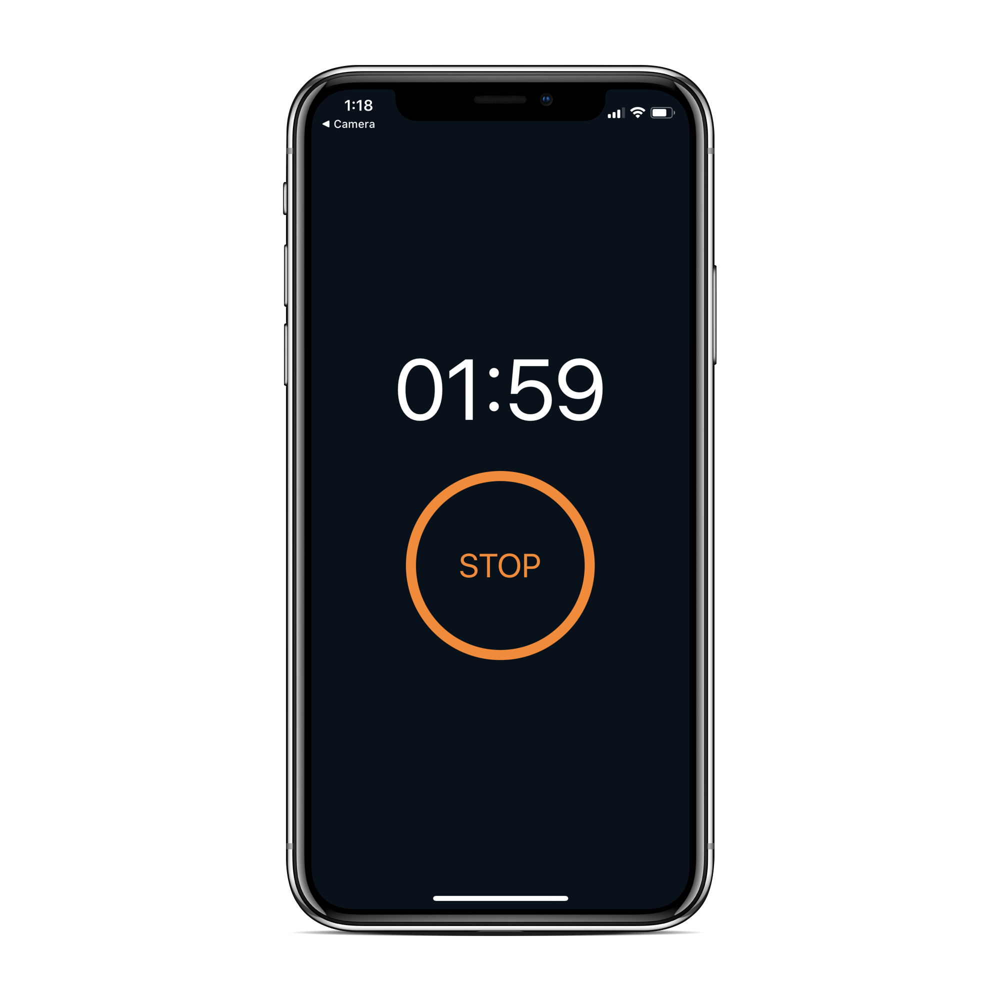
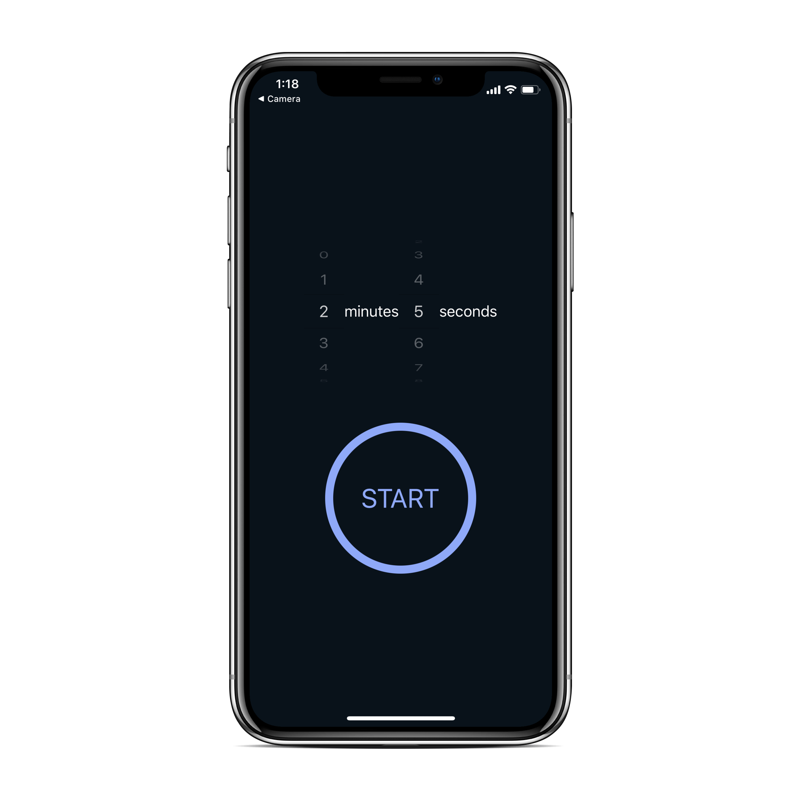

## React Native Timer App

A simple cross platform (iOS and Android) React Native timer app.

 

### Installation

- `git clone https://github.com/Manojj999/RN-Timer.git`
- `yarn install`/`npm install`

### Running

- For Emulator:
---
- `yarn run ios`/`npm run ios` or `yarn run android`/`npm run android`

-For Actual Device
---
- Install Expo Client on Android Or Ios then
- `yarn start`/`npm start`
- Scan Qr code

